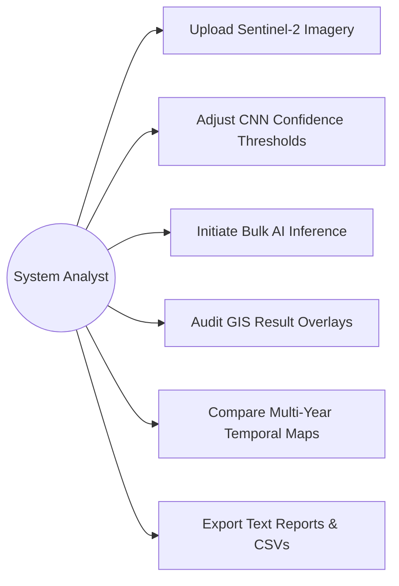
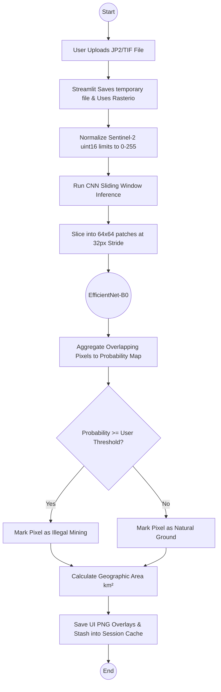
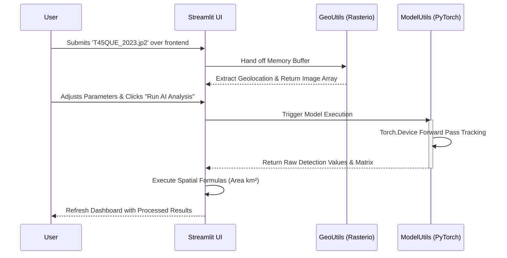
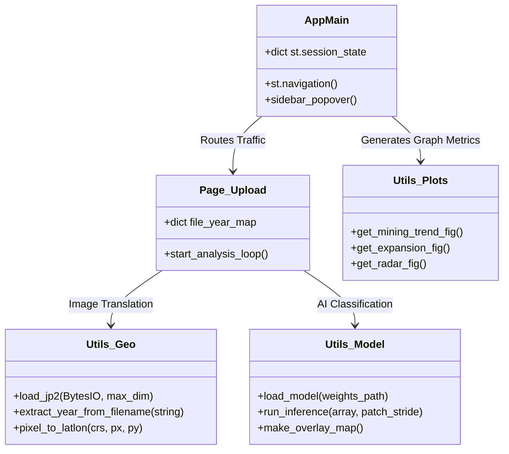
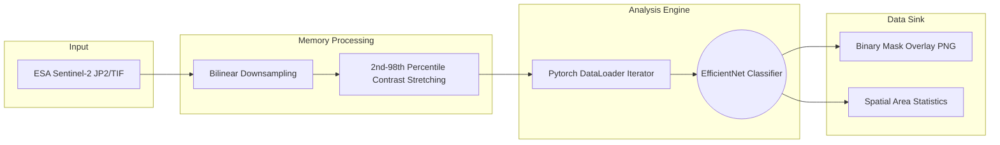

# MineWatch System Architecture Diagrams (UML)

This document contains standardized software tracking charts formatted in Mermaid language. 
You can paste these blocks into online viewers like https://mermaid.live/ to generate instant flowchart images.

## 1. Use Case Diagram
Defines the actors and the specific actions they are permitted to execute in the system.

## 2. Activity Diagram
Maps the logical step-by-step decision flowchart of what happens during the core process (Analysis).

## 3. Sequence Diagram
Shows the chronological sequence of requests between the User, the App Frontend, and the Python Backend across a standard temporal run.

## 4. Class / Component Diagram
Shows how your separate python files map together methodically.

## 5. Data Architecture Flow
Traces the physical trajectory of data from a raw disk file to a localized graphical output.

